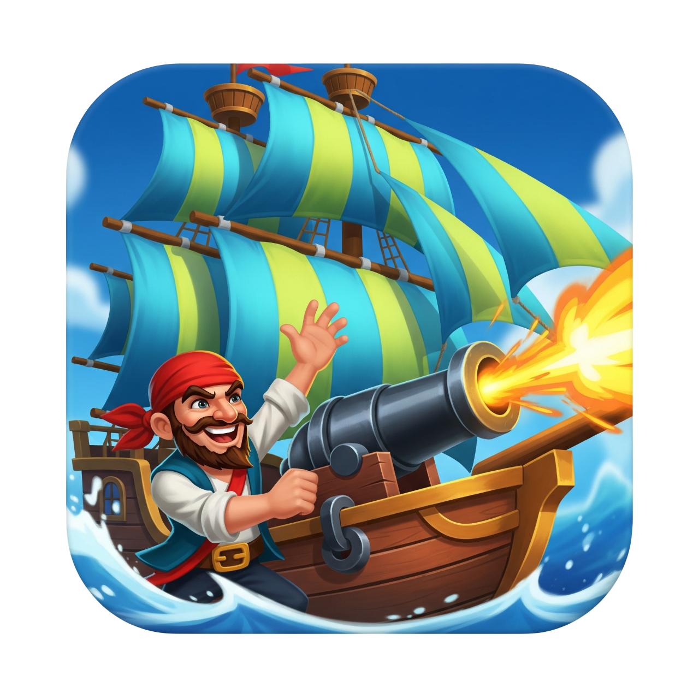

# BattleshiPPS
{: .fs-9 }

Implementazione, in Scala, del gioco "battaglia navale" (Battleship) per il corso di "Paradigmi di Programmazione e Sviluppo".
{: .fs-6 .fw-300 }

[Documentazione](report/introduzione.md){: .btn .btn-primary .fs-5 .mb-4 .mb-md-0 .mr-2 }
[Repository GitHub](https://github.com/fairlycodeparents/PPS-24-BattleshiPPS){: .btn .fs-5 .mb-4 .mb-md-0 }