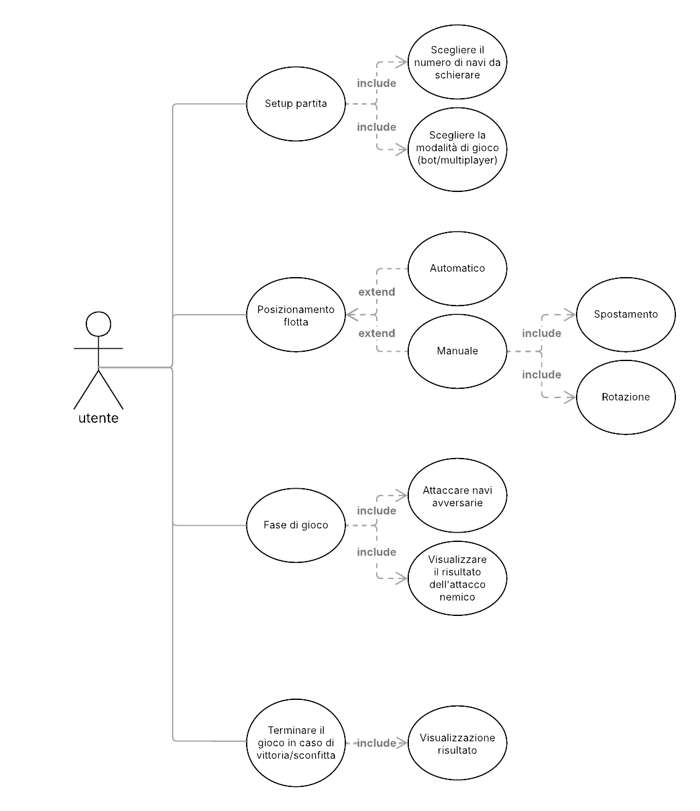

# Requisiti
L'analisi del problema svolta nella prima fase del progetto ha permesso di evidenziare i requisiti elencati di seguito.

## Requisiti di business
- Creare un sistema intuitivo e fedele alla versione classica
- Introdurre sia una modalità multiplayer _hotseat_ (due giocatori sullo stesso dispositivo) sia una modalità vs bot
- Fornire la possibilità di personalizzare la partita (regole, posizionamento delle navi, difficoltà del bot)
- Offrire un'interfaccia semplice e chiara, entro un mese e mezzo dall’avvio del progetto.

## Modello di dominio
Il dominio del progetto ruota attorno ai seguenti concetti principali:

- _Player_: entità che prende parte alla partita, umano o bot.
- _Board_: griglia di celle che rappresenta il campo di gioco, una per ogni giocatore.
- _Ship_: unità posizionabile sul tabellone; di tipologia diversa in base alla lunghezza.
- _Game_: insieme delle fasi di gioco (posizionamento, turni, attacco) che termina con la vittoria di uno dei giocatori.

## Requisiti funzionali
### Requisiti di utente
Dal punto di vista dell’utente, il sistema deve consentire:
- Il setup della partita:
  - scelta delle regole
    - numero di navi
    - modalità (multiplayer o contro bot)
  - posizionamento automatico o manuale delle navi (rotabili) nella propria board.
- L'interazione di gioco:
  - giocare a turno, scegliendo la cella della board avversaria da colpire
  - visualizzare chiaramente i risultati di ogni colpo (mancato, colpito, affondato) 
  e i feedback sullo stato della partita.
- La ricezione della notifica di fine della partita e del vincitore.

Funzionalità opzionali:
- selezionare il livello di difficoltà del bot
- utilizzare colpi speciali (ad area, multipli, ecc.)
- partite con ostacoli nel tabellone che limitano i possibili posizionamenti.

### Requisiti di sistema
Il sistema dovrà occuparsi di:
- validare il posizionamento delle navi (niente sovrapposizioni o posizionamenti fuori dalla board)
- gestire l'attacco e i turni, impedendo mosse illegali (colpire celle già scelte)
- aggiornare in tempo reale lo stato della board e le navi colpite
- riconoscere automaticamente il termine della partita (tutte le navi affondate)
- integrarsi con il DSL per modellare lo stato e testare scenari di gioco.

## Requisiti non funzionali
Il sistema dovrà rispettare le seguenti proprietà generali:
- performance: risposte rapide a input dell’utente
- scalabilità: possibilità di aggiungere regole o modalità di gioco senza stravolgere l’architettura
- affidabilità: garantire che la logica di gioco non porti mai a stati incoerenti
- usabilità: interfaccia intuitiva, semplice e adatta a ogni utente, senza manuale d’uso
- manutenibilità: codice modulare e documentato per semplificare estensioni e modifiche
- testabilità: testing e utilizzo di DSL per simulare partite e validare i comportamenti

## Requisiti di implementazione
- Sviluppo con metodologia SCRUM-inspired, con iterazioni brevi e integrazione continua.
- Un'architettura basata su una netta separazione tra logica di gioco e interfaccia utente.
- Utilizzo di funzionalità avanzate di Scala 3.x sfruttando la programmazione funzionale.
- Sperimentazione dell’approccio Test-Driven Development (TDD).
- Versioning e gestione collaborativa del codice.
