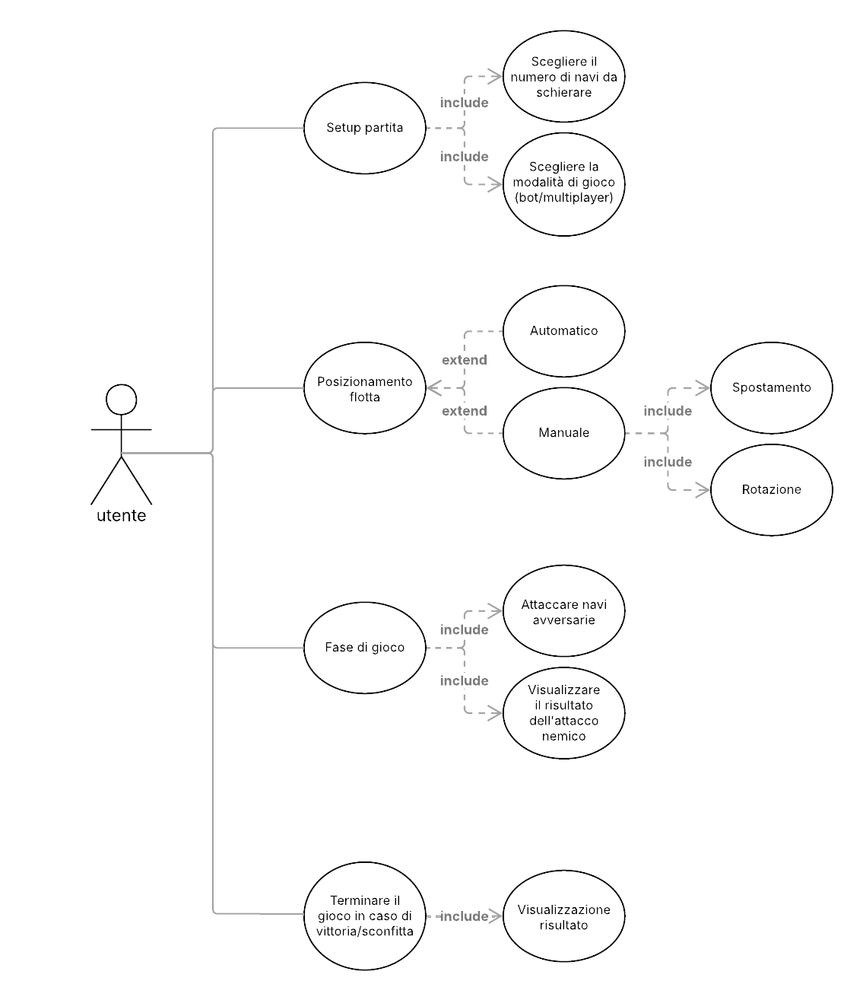

# Requisiti
L'analisi del problema svolta nella prima fase del progetto ha permesso di evidenziare i requisiti elencati di seguito.

## Requisiti di business
- Creare un sistema intuitivo e fedele alla versione classica, sfruttando una modalità di gioco multiplayer _hotseat_
(due giocatori sullo stesso dispositivo), o una modalità singleplayer, dove l'utente gioca contro un bot.
- Realizzare il progetto entro un mese e mezzo dall’avvio del progetto.

## Modello di dominio
Il dominio del progetto ruota attorno ai seguenti concetti principali:

- _Player_: Entità che prende parte alla partita, umano o bot.
- _Board_: Griglia di celle che rappresenta il campo di gioco, una per ogni giocatore. Al suo interno, la plancia
contiene sia le navi posizionate che i colpi subiti.
- _Ship_: Singola unità posizionata sul tabellone, definita tramite una posizione iniziale, una direzione (orizzontale o
verticale) e una lunghezza. Può essere colpita e affondata.
- _Game_: Insieme delle fasi di gioco (posizionamento, turni, attacco) che termina con la vittoria di uno dei giocatori.

## Requisiti funzionali
### Requisiti di utente
Dal punto di vista dell’utente, il sistema deve consentire:
- Il setup della partita:
  - scelta delle regole
    - numero di navi
    - modalità (multiplayer o contro bot). In caso di partita singleplayer (contro bot), scelta del livello di difficoltà
  - posizionamento automatico o manuale delle navi (rotabili) nella propria board.
- L'interazione di gioco:
  - giocare a turno, scegliendo la cella della board avversaria da colpire
  - visualizzare chiaramente i risultati di ogni colpo (mancato, colpito, affondato) 
  e i feedback sullo stato della partita.
- La ricezione della notifica di fine della partita e del vincitore.

### Requisiti di sistema
Il sistema dovrà occuparsi di:
- validare il posizionamento delle navi (niente sovrapposizioni o posizionamenti fuori dalla board);
- gestire l'attacco e i turni, impedendo mosse illegali (colpire celle già scelte);
- aggiornare in tempo reale lo stato della board e le navi colpite;
- riconoscere automaticamente il termine della partita (tutte le navi affondate);
- integrarsi con il DSL per modellare lo stato e testare scenari di gioco.

## Requisiti non funzionali
### Requisiti esterni
- Performance: risposte rapide agli input dell’utente (<=500ms).
- Affidabilità: il sistema deve garantire il completamento della partita senza crash o perdite di dati, gestendo
gli input errati dell'utente.
- Usabilità: interfaccia intuitiva e semplice, che possa essere utilizzata da ogni utente, senza dover consultare un 
manuale d’uso. L'interfaccia grafica deve contenere elementi visivi chiari e coerenti, con feedback immediati sulle
azioni dell'utente e brevi indicazioni testuali ove necessario.
### Requisiti interni
- Scalabilità: possibilità di aggiungere regole o modalità di gioco senza stravolgere l’architettura.
- Manutenibilità: codice modulare e documentato per semplificare estensioni e modifiche.
- Testabilità: testing e utilizzo di DSL per simulare partite e validare i comportamenti.

## Requisiti di implementazione
- Sviluppo con metodologia SCRUM-inspired, con iterazioni brevi e integrazione continua.
- Un'architettura basata su una netta separazione tra logica di gioco e interfaccia utente.
- Utilizzo di funzionalità avanzate di Scala 3.x sfruttando la programmazione funzionale.
- Sperimentazione dell’approccio Test-Driven Development (TDD).
- Versioning e gestione collaborativa del codice.
