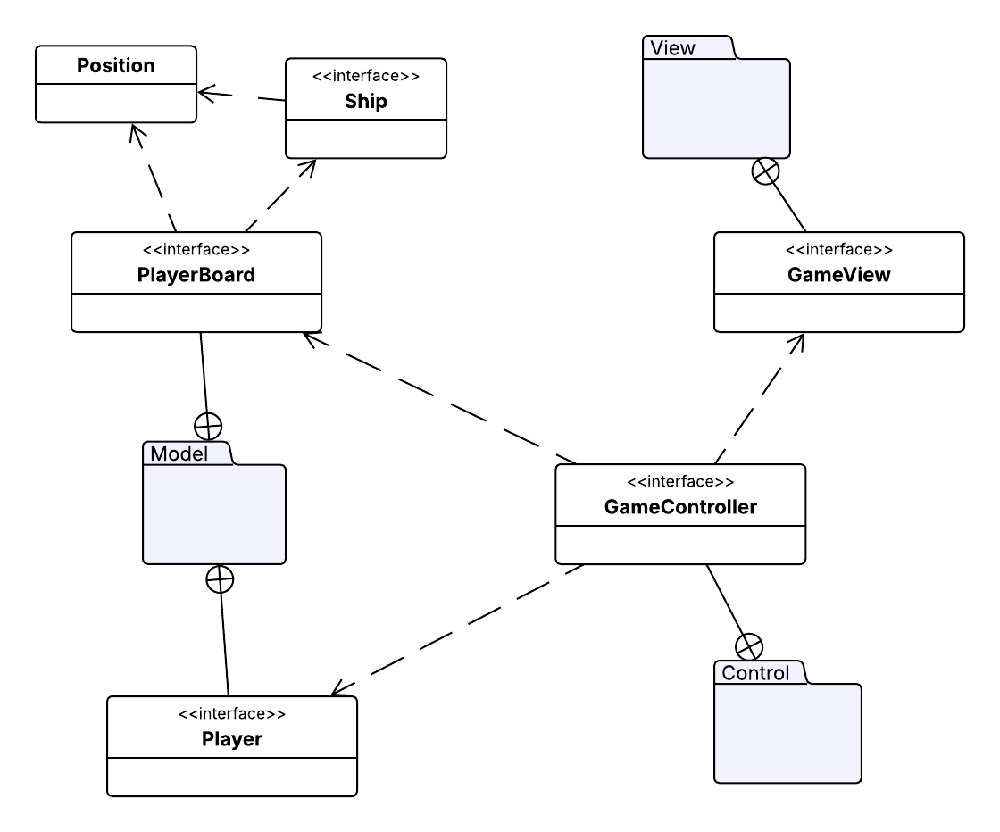

# Design architetturale

Il design architetturale del sistema è stato elaborato a partire dai requisiti funzionali e non funzionali identificati. 
L'obiettivo principale è stato creare una struttura modulare, manutenibile ed estensibile che potesse gestire la 
complessità di un gioco come _Battaglia Navale_, garantendo una chiara separazione delle responsabilità tra i vari 
componenti.

## Pattern Architetturale MVC (Model-View-Controller)

Questo pattern è ampiamente utilizzato nello sviluppo di applicazioni software per separare la logica dalla sua 
rappresentazione grafica e dall'interazione con l'utente. I suoi tre componenti principali svolgono ruoli specifici:

* **Model**: Il Model rappresenta il cuore dell'applicazione. Contiene i dati e la logica di business del sistema. La 
  sua responsabilità è gestire lo stato dell'applicazione, manipolare i dati e notificare eventuali cambiamenti ai 
  componenti che dipendono da esso. È completamente disaccoppiato dalla rappresentazione grafica e non ha conoscenza 
  dell'interfaccia utente. Nel nostro caso, il Model dovrà contenere tutte le regole del gioco, lo stato della partita, 
  la posizione delle navi e la logica dei giocatori. 
* **View**: La View è l'interfaccia utente. Il suo scopo è presentare i dati del Model all'utente e raccogliere gli 
  input dell'utente. La View non contiene alcuna logica e si limita a visualizzare lo stato corrente del 
  Model. Quando l'utente interagisce con la View (ad esempio, cliccando su un bottone), questa inoltra l'input al 
  Controller per la sua elaborazione. 
* **Controller**: Il Controller agisce come intermediario tra il Model e la View. Riceve l'input dall'utente tramite la 
  View, lo elabora, aggiorna il Model di conseguenza e, se necessario, istruisce la View a riflettere i cambiamenti di 
  stato. In sostanza, il Controller coordina il flusso di dati e la logica di interazione, garantendo che le diverse 
  parti dell'applicazione rimangano indipendenti.

Questa separazione è la motivazione per la quale abbiamo scelto di utilizzare il pattern MVC per il nostro progetto. 
Permette di sviluppare e testare ciascun componente in modo indipendente, facilita la manutenzione e l'estensione del
sistema. Inoltre, consente di sostituire facilmente la View senza dover modificare il Model o il Controller.

## Struttura del Progetto

La struttura del progetto è organizzata in tre moduli principali, corrispondenti ai componenti del pattern MVC:
* Model: Contiene la logica del gioco e la gestione dello stato.
    * `PlayerBoard`: Rappresenta la plancia di gioco, gestendo navi, colpi e la loro posizione.
    * `GameConfig`: Incapsula la configurazione delle navi per una partita.
    * `Player`: Rappresenta i giocatori, sia umani che bot.
    * `AttackStrategy`: Rappresenta la strategia utilizzata dai bot per attaccare.
    * `Position`: Classe di supporto per la gestione delle coordinate.
    * `Ship`: Rappresenta le navi e le loro posizioni sulla plancia.
* Controller: Contiene i componenti che gestiscono la logica di gioco e coordinano la comunicazione tra il Model e la View.
    * `GameController`: Gestisce il flusso della partita, l'interazione tra i giocatori e gli aggiornamenti dello stato.
    * `GameSetup`:Gestisce la fase di configurazione, validando le scelte dell'utente prima che la partita inizi.
* View: Contiene tutti i componenti responsabili dell'interfaccia grafica e dell'interazione con l'utente.
    * `GameView`: Implementa l'interfaccia grafica del gioco, mostrando le plance, le navi e i risultati degli attacchi.
    * `SetupView`: Gestisce la configurazione iniziale della partita, consentendo agli utenti di scegliere le regole.
