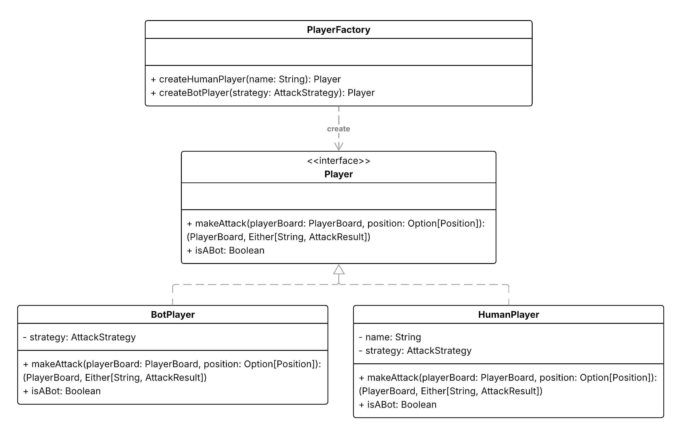
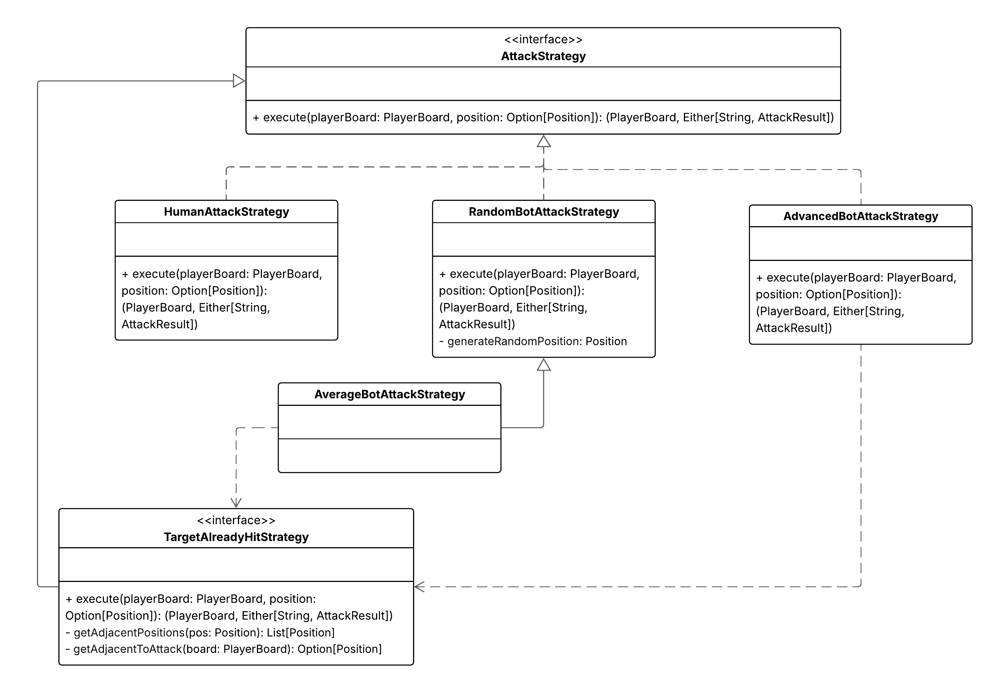

# Design di dettaglio

## Model

### Creazione delle navi
La creazione delle navi viene modellata attraverso l’uso dei _Factory Methods_ definiti nell’enumerazione `ShipType`.
Ogni tipologia di nave (`Frigate`, `Submarine`, `Destroyer`, `Carrier`) è associata a una lunghezza predefinita, 
mentre i factory methods consentono di istanziare navi già orientate e posizionate in modo semplice e leggibile.
In questo modo, la logica di costruzione è incapsulata nell’enumerazione, rendendo chiaro il tipo di nave che si sta creando.
Le principali interfacce coivolte sono riportate di seguito:

### Creazione dei giocatori

Anche per i giocatori viene scelto l’approccio dei _Factory Methods_, così da distinguere in maniera esplicita tra giocatori 
umani e bot (`HumanPlayer` e `BotPlayer`).
Questo permette di centralizzare la logica di inizializzazione, mantenendo coerente il processo di creazione 
ed evitando di esporre costruttori complessi all’esterno.

### Strategie di attacco e livello di difficoltà dei bot

Per quanto riguarda lo sviluppo delle diverse strategie di attacco, viene sfruttato il pattern _Strategy_.
Ogni strategia incapsula un algoritmo di selezione delle mosse, e può essere facilmente sostituita o combinata con altre 
senza modificare il codice interno.
In questo modo, il sistema è estendibile: aggiungere un nuovo livello di difficoltà o una nuova tattica richiede solo 
l’implementazione di una nuova strategia, senza intaccare la logica esistente.

Di seguito sono riportati, sottoforma di Diagramma delle Classi UML, tutti gli elementi che combinati tra loro 
permettono la creazione modulare delle diverse strategie:

## View

## Controller
