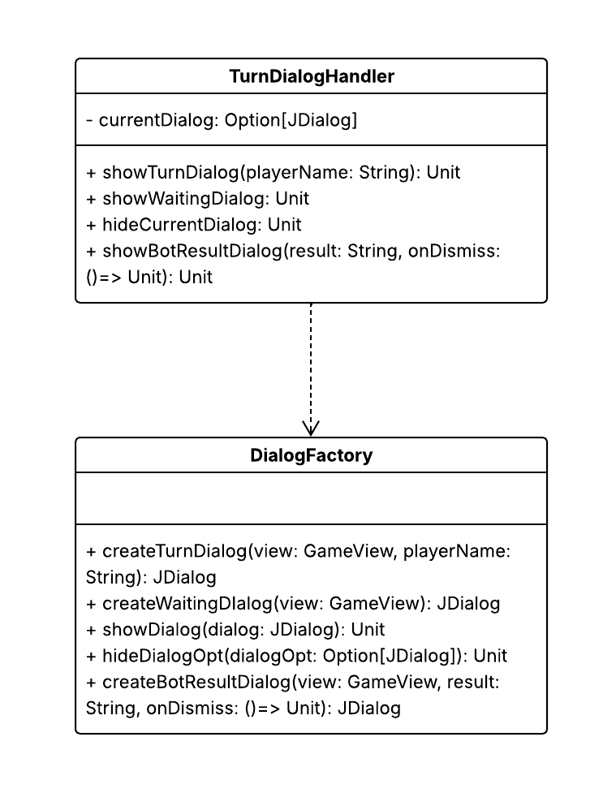

# Design di dettaglio

## Model
Il Model racchiude e gestisce l’intera logica di business del gioco. Di seguito sono riportate le principali scelte di 
design che hanno guidato l'implementazione di questo componente architetturale.

### Creazione delle navi
La creazione delle navi viene modellata attraverso l’uso dei _Factory Methods_ definiti nell’enumerazione `ShipType`.
Ogni tipologia di nave (`Frigate`, `Submarine`, `Destroyer`, `Carrier`) è associata a una lunghezza predefinita, 
mentre i factory methods consentono di istanziare navi già orientate e posizionate in modo semplice e leggibile.
In questo modo, la logica di costruzione è incapsulata nell’enumerazione, rendendo chiaro il tipo di nave che si sta creando.
Le principali interfacce coivolte sono riportate di seguito:

### Creazione dei giocatori

Anche per i giocatori viene scelto l’approccio dei _Factory Methods_, così da distinguere in maniera esplicita tra giocatori 
umani e bot (`HumanPlayer` e `BotPlayer`).
Questo permette di centralizzare la logica di inizializzazione, mantenendo coerente il processo di creazione 
ed evitando di esporre costruttori complessi all’esterno.

### Strategie di attacco e livello di difficoltà dei bot

Per quanto riguarda lo sviluppo delle diverse strategie di attacco, viene sfruttato il pattern _Strategy_.
Ogni strategia incapsula un algoritmo di selezione delle mosse, e può essere facilmente sostituita o combinata con altre 
senza modificare il codice interno.
In questo modo, il sistema è estendibile: aggiungere un nuovo livello di difficoltà o una nuova tattica richiede solo 
l’implementazione di una nuova strategia, senza intaccare la logica esistente.

Di seguito sono riportati, sottoforma di Diagramma delle Classi UML, tutti gli elementi che combinati tra loro 
permettono la creazione modulare delle diverse strategie:

## View
La view si occupa in un primo momento di gestire l'avvio della partita, che prevede le configurazioni iniziali, 
e successivamente, la gestione della partita. C'è una chiara separazione tra logica di visualizzazione, gestione degli
eventi e rendering. 
## Setup View
## Game View
Sono stati utilizzati i seguenti pattern:
- factory pattern: per `ButtonFactory`, che centralizza la creazione di bottoni, e `DialogFactory` che gestisce la
  creazione dei dialog
- observer pattern: per gestire facilmente le azioni dell'interfaccia utente come click o pressione dei tasti
- state pattern: rendering basato su `GamePhase`, la view cambia in base alla fase della partita
- strategy pattern: per incapsulare comportamenti alternativi, come per la gestione dei click. `ClickHandler` applica
  strategie divers per i diversi tipi di click 
- template method: i dialog hanno una struttura comune in `DialogFactory`, ma comportamenti specifici

    
    

## Controller
Il controller si occupa di gestire l'andamento della partita facendo collaborare la logica e la grafica.
La comunicazione con la logica viene delegata al `GameStateManager` che contiene solo *funzioni pure*, dove tutte le
operazioni restituiscono nuovi stati senza modificare l'input. Vengono quindi gestite le transizioni di stato del gioco 
e le regole, restituendo un `GameActionResult` con nuovo stato e azioni da compiere. Il `GameStateManager` si occupa 
quindi di:
-   avviare la partita tramite `handleStartGame`, che viene invocato al click del bottone
-   posizionare le navi tramite l'uso di `PositioningHandler`, differenziando i tipi di posizionamento, ovvero
    *SingleClick*, *DoubleClick* o *Random*
-   gestire la battaglia nel caso di attacco di un player umano, reagendo quindi al click di un bottone
    nella mappa tramite `ClickHandler`, o di un player bot.

Il coordinamento con la GUI è invece gestito direttamente nel `GameController`, che si occupa sia di operazioni
asincrone (tramite `DelayExecutor`, per la gestione di timer e dialog), sia di aggiornare la vista tramite il metodo
`updateView`. In questo modo, dopo ogni transizione di stato calcolata dal `GameStateManager`, la `GameView` viene
aggiornata. La gestione di fine partita viene eseguita ad ogni chiamata del metodo `update` di `GameView` che controlla
se la fase della partita sia impostata su *Game Over*.

  

