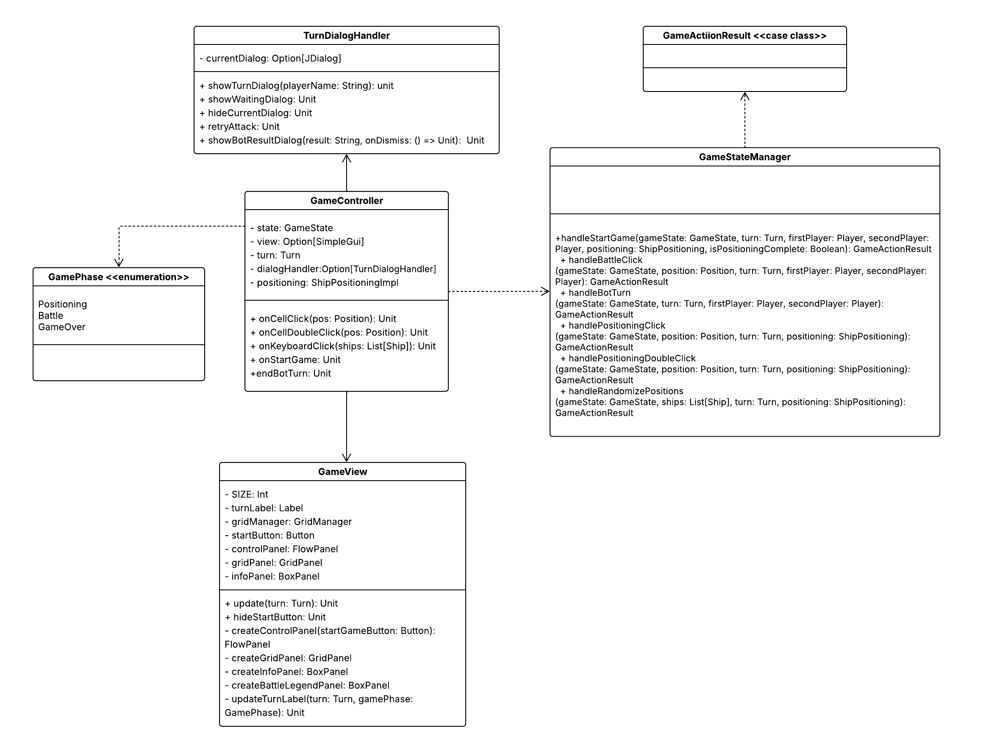

# Design di dettaglio

## Model

## View

## Controller
Il controller si occupa di gestire l'andamento della partita facendo collaborare la logica e la grafica.
La comunicazione con la logica viene delegata al `GameStateManager` che contiene solo *funzioni pure*, dove tutte le
operazioni restituiscono nuovi stati senza modificare l'input. Vengono quindi gestite le transizioni di stato del gioco 
e le regole, restituendo un `GameActionResult` con nuovo stato e azioni da compiere. Il `GameStateManager` si occupa 
quindi di:
-   avviare la partita tramite `handleStartGame`, che viene invocato al click del bottone
-   posizionare le navi tramite l'uso di `PositioningHandler`, differenziando i tipi di posizionamento, ovvero
    *SingleClick*, *DoubleClick* o *Random*
-   gestire la battaglia nel caso di attacco di un player umano, reagendo quindi al click di un bottone
    nella mappa tramite `ClickHandler`, o di un player bot.

Il coordinamento con la GUI è invece gestito direttamente nel `GameController`, che si occupa sia di operazioni
asincrone (tramite `DelayExecutor`, per la gestione di timer e dialog), sia di aggiornare la vista tramite il metodo
`updateView`. In questo modo, dopo ogni transizione di stato calcolata dal `GameStateManager`, la `GameView` viene
aggiornata. La gestione di fine partita viene eseguita ad ogni chiamata del metodo `update` di `GameView` che controlla
se la fase della partita sia impostata su *Game Over*.

  

